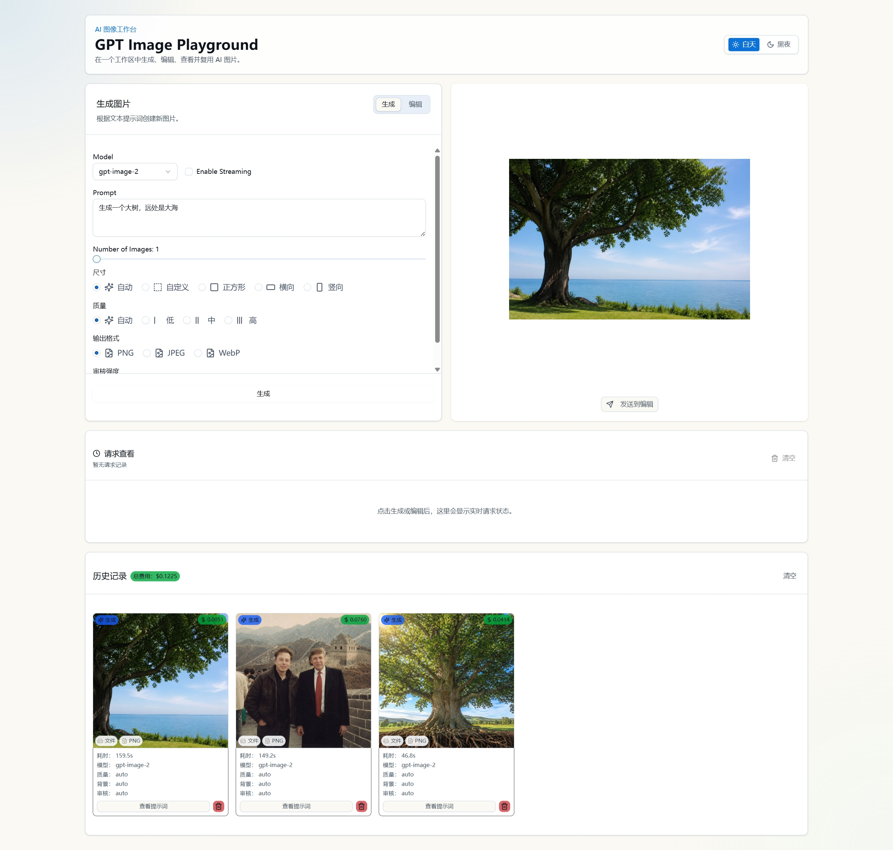
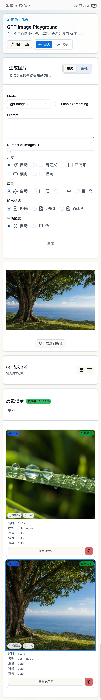

# GPT Image Playground

一个支持 Web 端和 Android APK 双端使用的 AI 图片生成/编辑工作台。Web 端适合在电脑浏览器中使用，APK 端适合安装到 Android 手机本地运行。

项目支持 `gpt-image-2`、`gpt-image-1.5`、`gpt-image-1` 和 `gpt-image-1-mini`，可使用 OpenAI 官方接口，也可配置兼容 OpenAI 协议的第三方接口。

<p align="center">
  
</p>
<p align="center">
  
</p>

## 双端能力

### Web 端

- 使用 Next.js 运行，可在电脑浏览器访问。
- 支持服务端 API 路由，API Key 只保存在服务端环境变量中。
- 本地开发默认可把生成图片保存到 `generated-images/`。
- 也可切换到 IndexedDB 存储，适合 Vercel 等无持久文件系统环境。

### Android APK 端

- 使用 Capacitor 打包，安装后可在 Android 手机上本地运行。
- APK 为静态前端，不依赖 Next.js 服务端 API 路由。
- API Key 和 Base URL 在 App 内“接口设置”中配置，保存在设备本地。
- 图片保存在设备 WebView 的 IndexedDB 中。
- 支持生成图片双指缩放、下载、系统分享。
- 内置“请求查看”面板，可查看请求状态、阶段、错误和响应摘要，方便排查卡在生成中的问题。

## 功能

- 图片生成：根据文本提示词生成图片。
- 图片编辑：上传、粘贴或复用历史图片后进行编辑。
- 蒙版编辑：可在图片上涂抹编辑区域，也可上传 PNG 蒙版。
- 参数控制：模型、尺寸、质量、输出格式、压缩率、背景、审核强度、图片数量等。
- `gpt-image-2` 自定义分辨率：支持 2K/4K 预设和自定义宽高，并进行尺寸约束校验。
- 流式预览：Web 端可在生成过程中查看阶段性预览图。
- 历史记录：保存生成/编辑记录、参数、提示词、图片数量和费用估算。
- 费用统计：展示单次请求和历史总计的 token 用量与美元估算。
- 图片查看：生成结果支持放大查看、双指缩放、拖动查看细节。
- 图片下载和分享：支持下载生成图片；APK 端支持调起 Android 系统分享面板。
- 请求查看：类似简化版 Network 面板，实时记录请求阶段、URL、Base URL、状态码、错误和响应摘要。
- 明暗主题：支持浅色/深色主题切换。

## 环境要求

- Node.js 20 或更高版本
- npm
- Android APK 打包需要 Android Studio / Android SDK / JDK 17

## Web 端本地运行

### 1. 安装依赖

```bash
npm install
```

### 2. 配置环境变量

在项目根目录创建 `.env.local`：

```dotenv
OPENAI_API_KEY=your_openai_api_key_here
```

可选：配置兼容 OpenAI 协议的第三方接口。

```dotenv
OPENAI_API_BASE_URL=https://your-compatible-api.example.com/v1
```

可选：给 Web 端加访问密码。

```dotenv
APP_PASSWORD=your_password_here
```

可选：配置图片存储模式。

```dotenv
# fs: 保存到服务端 ./generated-images，适合本地 Web 运行
# indexeddb: 图片返回到浏览器并保存到 IndexedDB，适合 Vercel 或 APK
NEXT_PUBLIC_IMAGE_STORAGE_MODE=fs
```

如果没有设置 `NEXT_PUBLIC_IMAGE_STORAGE_MODE`，本地默认使用 `fs`，Vercel 环境默认使用 `indexeddb`。

### 3. 启动开发服务

```bash
npm run dev
```

打开 [http://localhost:3000](http://localhost:3000) 使用。

局域网访问可使用：

```bash
npm run dev:lan
```

### 4. 构建生产版本

```bash
npm run build
npm run start
```

## Android APK 打包

APK 端构建会使用静态导出，不包含 `src/app/api` 服务端路由。运行时在 App 内配置 API Key 和 Base URL。

### 1. 同步 Web 静态资源到 Android

```bash
npm run cap:sync
```

### 2. 生成 debug APK

```bash
cd android
.\gradlew.bat assembleDebug
```

生成文件：

```text
android/app/build/outputs/apk/debug/app-debug.apk
```

也可以直接使用脚本：

```bash
npm run apk:debug
```

## APK 内接口配置

首次打开 APK 时，如果没有配置 API Key，会弹出“接口设置”。

- API Key：填写你的 OpenAI 或第三方兼容接口 Key。
- Base URL：填写兼容 OpenAI 协议的接口地址，例如 `https://api.example.com/v1`。

注意：APK 是本地应用，Key 保存在当前设备本地；不要把包含个人 Key 的截图、录屏或导出的 App 数据公开。

## 部署到 Vercel

建议环境变量：

```dotenv
OPENAI_API_KEY=your_openai_api_key_here
APP_PASSWORD=your_password_here
NEXT_PUBLIC_IMAGE_STORAGE_MODE=indexeddb
```

如果部署为公开站点，建议设置 `APP_PASSWORD`，避免公开页面被他人消耗你的 API 额度。

## 目录说明

- `src/app/page.tsx`：主页面状态和业务流程。
- `src/app/api/images/route.ts`：Web 端图片生成/编辑 API。
- `src/components/generation-form.tsx`：图片生成表单。
- `src/components/editing-form.tsx`：图片编辑和蒙版表单。
- `src/components/image-output.tsx`：图片输出、缩放、下载和分享。
- `src/components/request-inspector.tsx`：请求查看面板。
- `src/components/history-panel.tsx`：历史记录和费用详情。
- `src/lib/native-openai.ts`：APK 端本地 OpenAI/兼容接口请求逻辑。
- `android/`：Capacitor Android 工程。
- `scripts/build-capacitor-web.mjs`：APK 静态构建脚本。
- `generated-images/`：Web 端 `fs` 存储模式下的本地图片输出目录。

## 公开到 GitHub 前的安全注意事项

本项目设计上不会把服务端 `OPENAI_API_KEY` 打包进前端或 APK：

- Web 端使用 `OPENAI_API_KEY`，只在 Next.js API route 服务端读取。
- APK 端不读取 `.env.local` 中的 `OPENAI_API_KEY`，而是在 App 内本地配置 API Key。
- `.env*` 已在 `.gitignore` 中忽略，`.env.example` 和 `.env.local.example` 除外。
- `generated-images/`、`.next/`、`out/`、Android build 输出目录不会提交。

公开仓库前请确认：

- 不要提交 `.env.local`、`.env.production` 等真实环境变量文件。
- 不要提交真实 API Key、第三方接口 Key、访问密码或私有 Base URL。
- 不要把带 Key 的日志、截图、录屏提交到仓库。
- 如果某个 Key 曾经进入 Git 历史，应该立即在服务商后台撤销并重新生成。
- 如果使用公开部署，务必设置 `APP_PASSWORD` 或接入你自己的鉴权。

## 致谢

本项目基于 [alasano/gpt-image-playground](https://github.com/alasano/gpt-image-playground) 修改和扩展而来。感谢原作者提供的项目基础与开源工作。

## License

MIT
